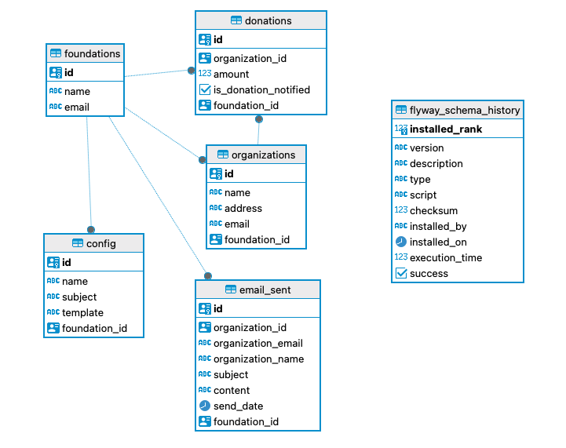
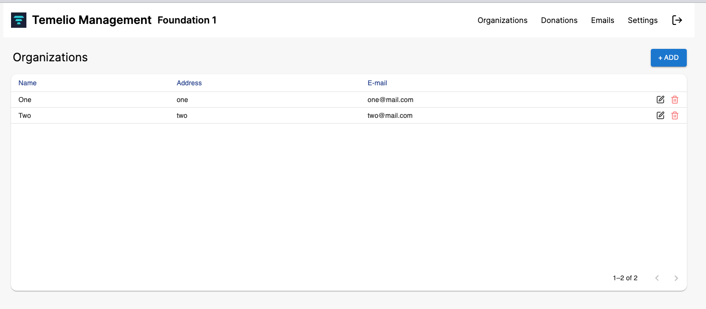
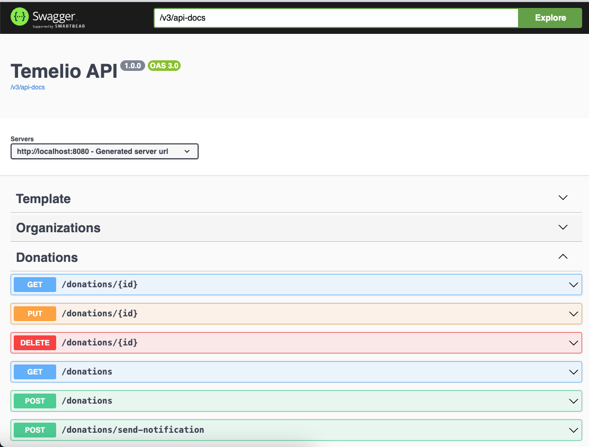
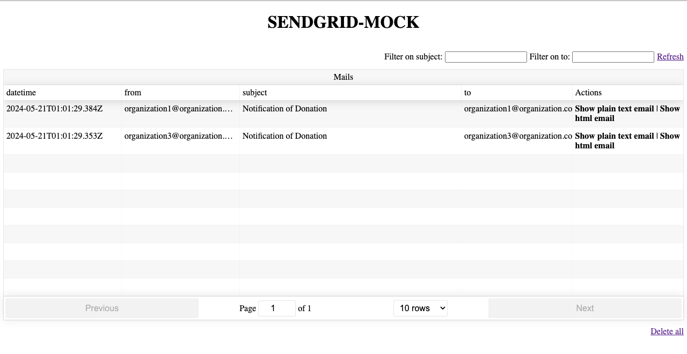
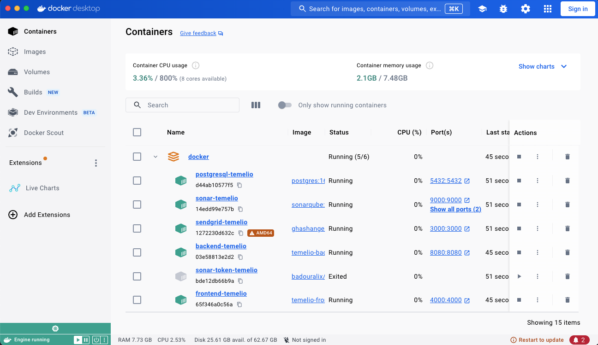

# Email System for Nonprofit Organizations by Temelio

## Overview

The Email System for Nonprofit Organizations by Temelio was developed to automate the process of sending personalized emails to nonprofit organizations, especially foundations. The solution was built with the following components:

### Backend
- Java with Spring Boot for business logic, data persistence, and communication with external services.
- PostgreSQL database for storing data of organizations, donations, and sent emails.
- Migrations were utilized for database schema management and version control.

<p align="center">
  
</p>

### Frontend
- **Next.js with React for a responsive and user-friendly user interface**

<p align="center">
  
</p>

### Additional Tools
- **Swagger for API endpoint documentation**

  <p align="center">
    
  </p>

- **SendGrid mock for simulating email sending**

  <p align="center">
    
  </p>


### Docker Integration
- Docker and Docker Compose are used to containerize and manage the entire application stack, providing easy setup and deployment.

  <p align="center">
    
  </p>


## Environment Setup

### Prerequisites
- Docker and Docker Compose installed
- Java 11 or higher
- Node.js and npm

### Configuration Instructions

1. Clone the repository:

2. Navigate to the Docker folder:
    ```sh
    cd docker
    ```

3. Start Docker containers:
    ```sh
    docker-compose up -d
    ```
    
### Running from your desk

#### Backend Configuration

Before starting the backend, make sure to have the following environment variables configured:
    
    export DATABASE_HOSTNAME="localhost:5432"
    export DATABASE_NAME="temelio"
    export DATABASE_PASSWORD="t3m3l10"
    export DATABASE_USERNAME="postgres"
    export SENDGRID_API_KEY="sendgrid-temelio"
    export SENDGRID_HOST="http://localhost:3000"

#### Frontend Configuration

Before starting the frontend, make sure to configure the following environment variables in the .env file located in the frontend directory:


    NEXT_PUBLIC_API_URL=http://localhost:8080

#### Note:
Remember to stop the respective containers if they are running locally to avoid conflicts.


### Tools and Services

- **Swagger (API Documentation)**: http://localhost:8080/swagger-ui.html
- **Frontend Application**: http://localhost:4000
- **SendGrid Mock**: http://localhost:3000

## How to Use

1. Access the frontend application at http://localhost:4000.
2. Use the frontend to create and manage organizations, customize emails, and view sent emails.
3. Refer to the Swagger API documentation for details on endpoints and their functionalities.
